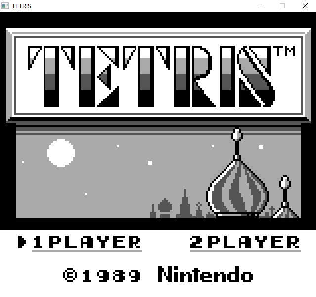

# GameBoy Emulator
This is an emulator of Nintendo's original GameBoy handheld console. This was written as an exercise to explore the architecture of the GameBoy hardware, learn how a CPU functions, and how simple 2D graphics are rendered. This project also allowed me to practice development of a large C++ project through proper project structure and test-driven development. The source code is covered by unit tests written using Google Test.

## Support
This emulator currently only supports original GameBoy cartridges which use ROM banks only. My goals are to support Super GameBoy, GameBoy Color, and cartridges using memory banks in the future.

- Examples of games that are supported are Tetris and Dr. Mario.

## Building
This project uses the [CMake](https://cmake.org/download/) build system to ensure compatibility cross-platform. Ensure your CMake version is greater than 3.10. [SFML](https://www.sfml-dev.org/download/sfml/2.5.1/) and [Qt](https://www.qt.io/download) are also required to build this project. Make sure that the SFML and Qt versions are compatible with your compiler (for example, SFML is only compatible with MinGW version 7.3.0).

Note: For Linux, install the following packages
```
sudo apt-get install qt5-default
sudo apt-get install libsfml-dev
```

Note: For Windows, ensure the following are added to your PATH environment variable (replace with the applicable installation directories for CMake, SFML, Qt, and your compiler e.g. MinGW)
```
C:\Program Files\CMake\bin
C:\SFML-2.5.1\bin
C:\SFML-2.5.1\lib
C:\Qt\5.14.2\mingw73_32\bin
C:\Qt\5.14.2\mingw73_32\lib
```

For Windows, also ensure to change `SFML_DIR` and `QT5_DIR` in *CMakeLists.txt* in the project root directory.

In a terminal, clone this repo from GitHub and update submodules.
```
git clone git@github.com:aidan-clyens/GameBoyEmu.git
cd GameBoyEmu
git submodule update --init
```

In your project directory, create a *build* folder.
```
mkdir build
cd build
cmake-gui ..
```

In CMake's GUI, click **Configure** and select the generator (e.g. MinGW Makefiles for Windows, Unix Makefiles for Linux). Click **Generate**.

Build project in the *build* directory
```
cd build
make
```

## Running
There are two executables built GameBoyEmu, a CLI and GUI version. The CLI version requires you to provide the path of the ROM file, and the GUI version opens a file explorer.

Example: `./build/src/GameBoy`\
Example: `./build/src/GameBoy_cli roms/DrMario.gb --trace`

CLI Options:\
--trace: Print out instructions executing by CPU line by line\
--warnings: Only print out warnings\
--debug: Enable step-by-step debugger\
--headless: Run GameBoy Emulator without GUI

## Testing
Run all GoogleTest and Pytest test cases:
```
cd build
make test
```

Run GoogleTest unit tests:
```
./build/test/Gameboy_tests
```

Run Blargg Test ROMs using pytest:
```
pytest test/run_blargg_tests.py
```


## Installing
Install GameBoyEmu using:
```
cd build
make install
```

To create a Windows installer, use:
```
cd build
cpack -C Release
```

## Screenshots
### Dr. Mario:


### Tetris:


## References
[Blargg Tests](https://gbdev.gg8.se/files/roms/blargg-gb-tests/)
