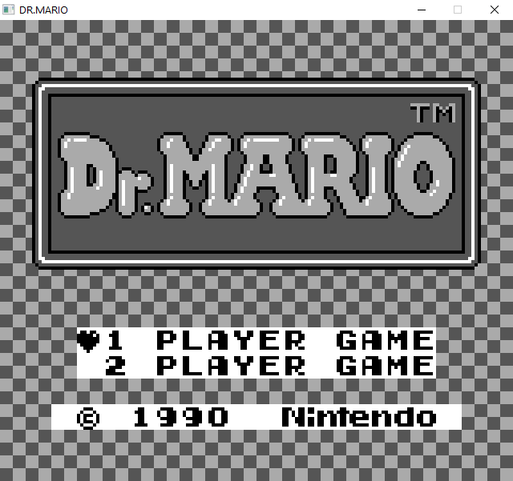

# GameBoy Emulator
This is an emulator of Nintendo's original GameBoy handheld console. This was written as an exercise to explore the architecture of the GameBoy hardware, learn how a CPU functions, and how simple 2D graphics are rendered. This project also allowed me to practice development of a large C++ project through proper project structure and test-driven development. The source code is covered by unit tests written using Google Test.

## Support
This emulator currently only supports original GameBoy cartridges which use ROM banks only. My goals are to support Super GameBoy, GameBoy Color, and cartridges using memory banks in the future.

- Examples of games that are supported are Tetris and Dr. Mario.

## Getting Started
- cmake is required to build this project

### First Time
1. Initialize repo
```
git clone git@github.com:aidan-clyens/GameBoyEmu.git
cd GameBoyEmu
git submodule update --init
```
2. Initialize cmake project
```
mkdir build
cd build
cmake ..
```

### Building
```
cd build
make
```

### Usage
Example: `./build/src/GameBoy_run roms/DrMario.gb`

Options:\
--trace: Print out instructions executing by CPU line by line\
--debug: Enable step-by-step debugger

## Screenshots
### Dr. Mario:


### Tetris:


## Author
Aidan Clyens